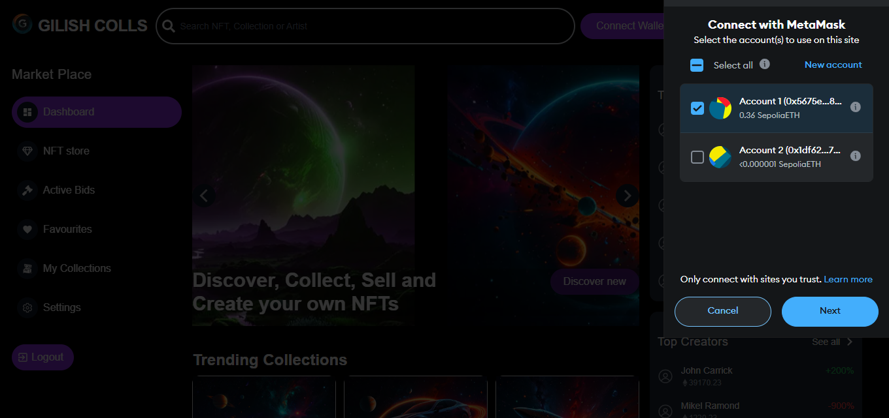

# Gilish Market



**Gilish Market** is a blockchain-based website designed to simplify interaction with an on-chain marketplace deployed on the Sepolia testnet. It aims to provide an intuitive experience for non-Web3 and non-technical users.  

[Live Demo](https://gilish-market.vercel.app/)

---

## Features

- **Simplified Interaction:** Makes interacting with blockchain marketplaces accessible for everyone.
- **User-Friendly Interface:** Optimized for users unfamiliar with blockchain technology.
- **Powered by Sepolia Testnet:** Leveraging Ethereum's Sepolia network for seamless integration.

---

## Installation and Setup

### Prerequisites
- Node.js installed on your machine.
- A Sepolia-compatible wallet for testing (e.g., MetaMask).

### Environment Variables
Create a `.env` file in the root directory and populate it with the following keys:

```bash
NFT_META_DATA_URL=""
DATABASE_URL=""
NFT_CONTRACT_ADDRESS="0x"
CLOUDINARY_API_KEY=""
CLOUDINARY_API_SECRET=""
NEXT_PUBLIC_CLOUDINARY_CLOUD_NAME=""
NEXT_PUBLIC_UPLOAD_PRESET=""
```

### Installation
1. Clone the repository:
   ```bash
   git clone <repository-url>
   cd <repository-folder>
   ```

2. Install dependencies:
   ```bash
   npm install --force
   ```

3. Add your environment variables to the `.env` file.

---

## Running the Application

### Development Mode
Start the application in development mode:
```bash
npm run dev
```
Access the app at [http://localhost:3000](http://localhost:3000).

### Production Mode
1. Build the application:
   ```bash
   npm run build
   ```
2. Start the production server:
   ```bash
   npm start
   ```

---

## Deployment

The application is deployed using **Vercel**. You can access the live demo at [Gilish Market Demo](https://gilish-market.vercel.app/).

---

## Technologies Used

- **Next.js:** For server-side rendering and React-based UI.
- **Tailwind** For styling.
- **Cloudinary:** For handling image uploads.
- **Ethereum & Sepolia Testnet:** Blockchain marketplace deployment.
- **wagmi/Ethers.js:** For interacting with the smart contract.

---

## Contributing

Contributions are welcome! To contribute:

1. Fork the repository.
2. Create a new branch for your feature:
   ```bash
   git checkout -b feature-name
   ```
3. Commit your changes:
   ```bash
   git commit -m "Add new feature"
   ```
4. Push the branch:
   ```bash
   git push origin feature-name
   ```
5. Open a pull request.

---

## License

This project is licensed under the [MIT License](LICENSE).

---

### Contact

For inquiries or support, contact us via email at **nwabuezegilbert@gmail.com**.
